<p align="center">
	
</p>

<div align="center"><b>AI-First Learning Management System powered by Xano</b></div>


<!-- Badges: responsive horizontal list that wraps when necessary -->
<div style="display:flex;gap:8px;flex-wrap:wrap;justify-content:center;align-items:center;max-width:500px;margin:0 auto;">
	<a href="https://www.xano.com/" target="_blank" rel="noreferrer">
		
	</a>
	<a href="https://simply-learn-xano.vercel.app/" target="_blank" rel="noreferrer">
		
	</a>
	<a href="https://nextjs.org/" target="_blank" rel="noreferrer">
		
	</a>
	<a href="https://ai.google.dev/" target="_blank" rel="noreferrer">
		
	</a>
	<a href="https://www.mux.com/" target="_blank" rel="noreferrer">
		
	</a>
	<a href="./LICENSE">
		
	</a>
</div>

<!-- Links: inline centered -->
<div style="text-align:center;margin-top:8px;line-height:1.6;">
	<div style="display:inline-flex;gap:12px;align-items:center;justify-content:center;">
		<a href="https://simply-learn-xano.vercel.app/" target="_blank" rel="noreferrer">Live demo</a>
		<span aria-hidden="true">|</span>
		<a href="https://xr83-nvl3-j8b3.n7e.xano.io/api:CPmqNnhk" target="_blank" rel="noreferrer">API (Swagger)</a>
		<span aria-hidden="true">|</span>
		<a href="https://www.xano.com/" target="_blank" rel="noreferrer">Xano Backend</a>
	</div>
</div>

---

<!-- Screenshots -->
## Screenshots

<details>
	<summary><b>Landing page</b></summary>
	

</details>

<details>
	<summary><b>Dashboard (student)</b></summary>
	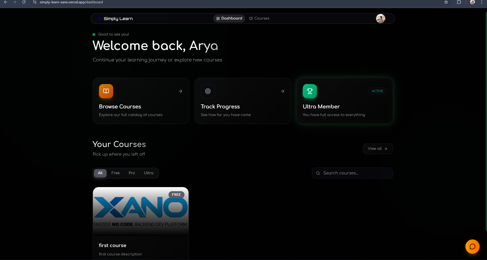

</details>

<details>
	<summary><b>Dashboard (teacher)</b></summary>
	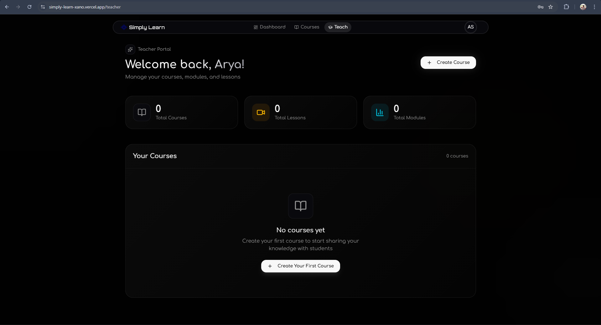

</details>

<details>
	<summary><b>Course preview</b></summary>
	

</details>

<details>
	<summary><b>Course creation</b></summary>
	

</details>

<details>
	<summary><b>Module creation</b></summary>
	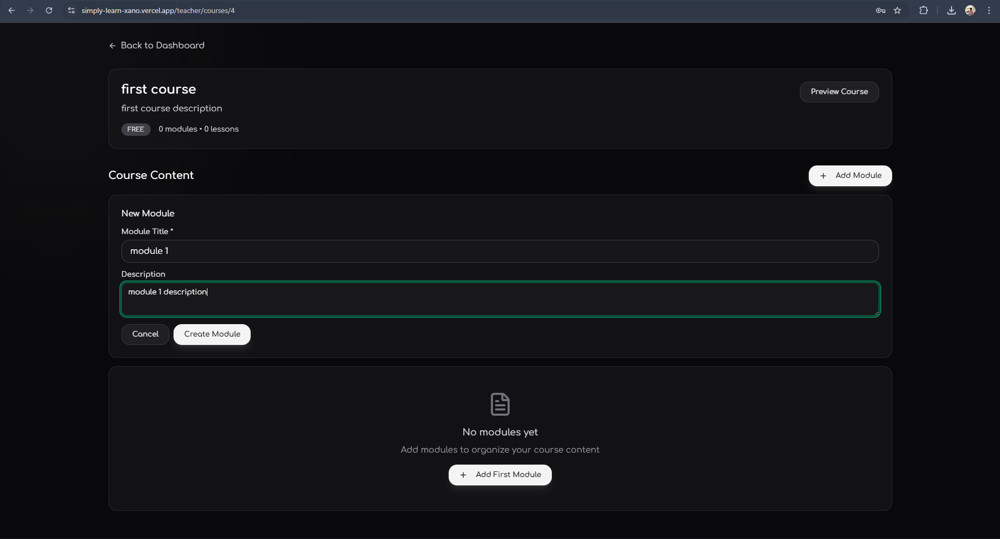

</details>

<details>
	<summary><b>Lesson page</b></summary>
	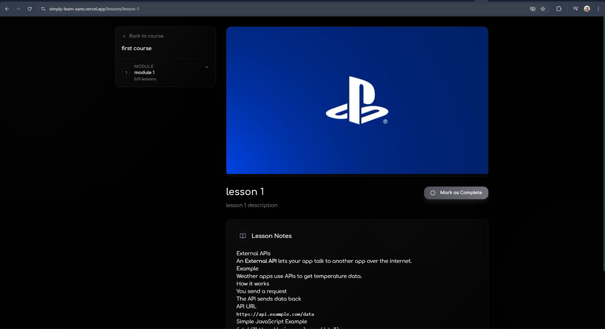

</details>

<details>
	<summary><b>Lesson creation</b></summary>
	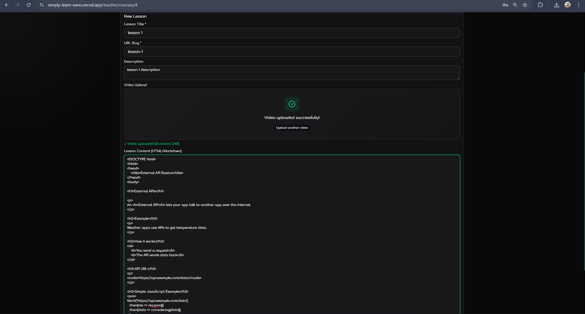

</details>

<details>
	<summary><b>Auth / Login</b></summary>
	

</details>

<details>
	<summary><b>Settings</b></summary>
	

</details>

<details>
	<summary><b>Pricing</b></summary>
	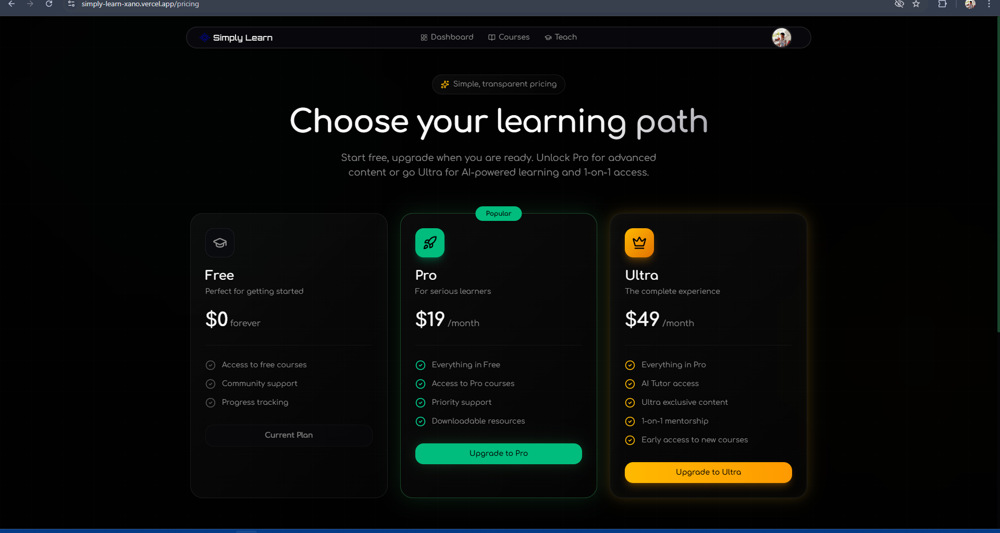

</details>

<details>
	<summary><b>AI chat preview</b></summary>
	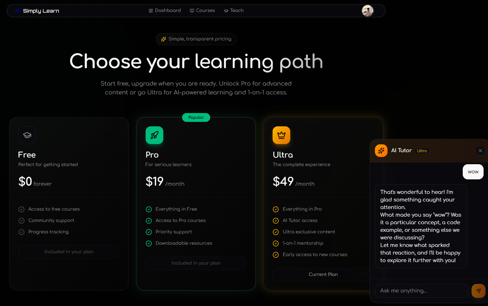

</details>

<details>
	<summary><b>Course creation - other</b></summary>
	

</details>

<details>
	<summary><b>Upgrade complete</b></summary>
	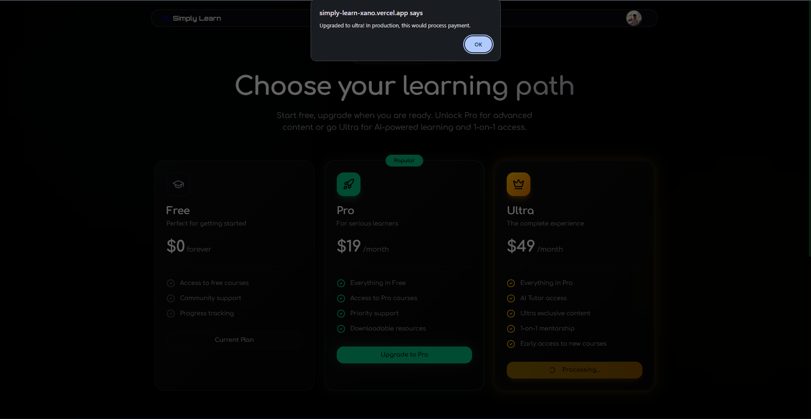

</details>

<details>
	<summary><b>Dashboard (updated)</b></summary>
	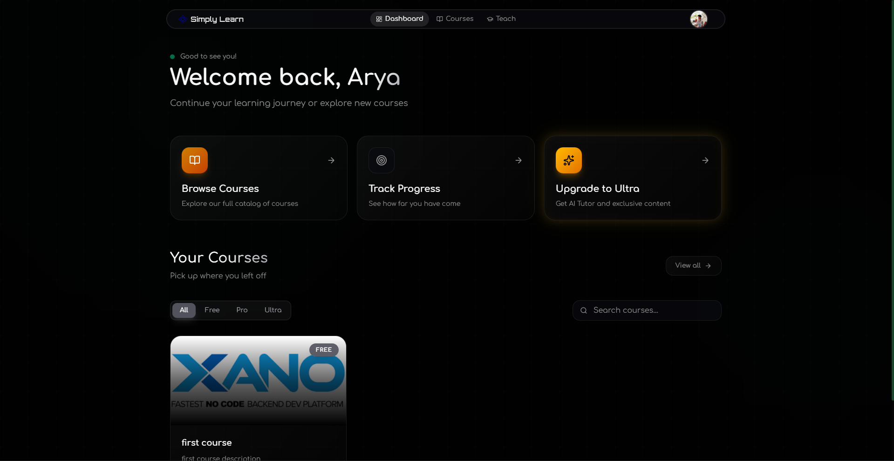

</details>

<details>
	<summary><b>MUX storage</b></summary>
	

</details>

<details>
	<summary><b>Xano — API & Schema</b></summary>
	<p style="margin-top:8px;">API builder, scripting and generated Swagger views from the Xano backend.</p>
	
	
	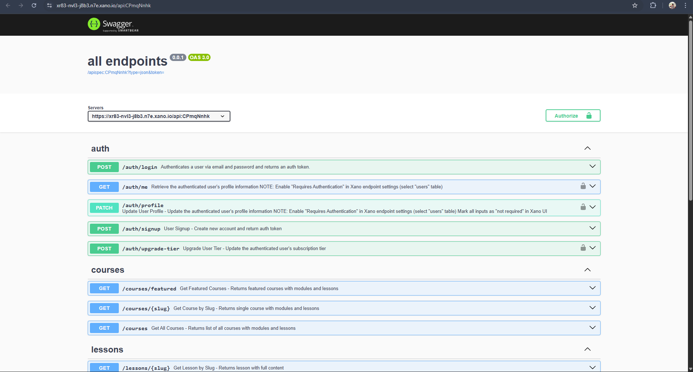
	
	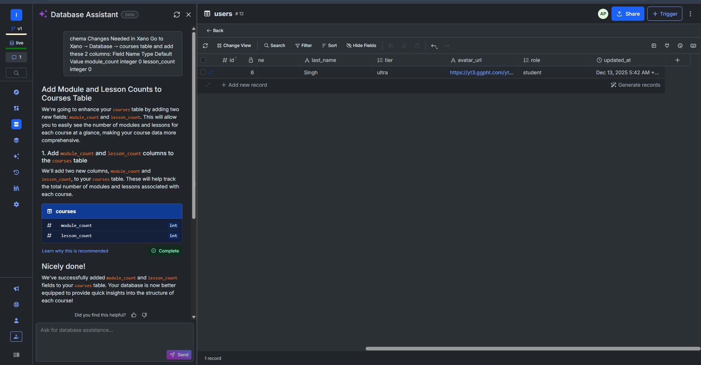

</details>

---

## What is Simply Learn?

This Next.js (secure) and **[Xano](https://www.xano.com/)** Powered Application is your ultimate Learning and Skill Improving Platform. You can create content and distribute content as well as consume other people's helpful content. Track and Level Up.

The entire backend — database, auth, business logic, external integrations — runs on **Xano**. No separate Node.js/Python server needed.

📚 **[API Documentation (Swagger)](https://xr83-nvl3-j8b3.n7e.xano.io/api:CPmqNnhk)**

---

## Why Xano?

| Capability          | How Xano Powers It                                               |
| ------------------- | ---------------------------------------------------------------- |
| **Database**        | PostgreSQL tables for users, courses, modules, lessons, progress |
| **Auth**            | Built-in JWT authentication with role-based access               |
| **API Builder**     | Visual no-code endpoints with XanoScript logic                   |
| **MUX Integration** | External API calls for video upload & signed playback            |
| **Scalability**     | Production-ready infrastructure, zero DevOps                     |

Xano replaced what would typically be an entire backend codebase. All API logic lives in [Xano's visual builder](https://www.xano.com/).

---

## Tech Stack

| Layer                  | Technology                           |
| ---------------------- | ------------------------------------ |
| **Backend & Database** | [Xano](https://www.xano.com/)        |
| **Frontend**           | Next.js 16, React 19, Tailwind CSS 4 |
| **AI**                 | Google Gemini 2.5 Flash              |
| **Video**              | MUX (streaming + direct uploads)     |

---

## Quick Start

```bash
git clone https://github.com/ARYPROGRAMMER/simply-learn.git
cd simply-learn
pnpm install
cp .env.example .env.local
pnpm dev
```

### Environment Variables

```env
NEXT_PUBLIC_XANO_API_URL=https://your-instance.xano.io/api:CPmqNnhk
GOOGLE_GENERATIVE_AI_API_KEY=your-gemini-key
```

---

## Database Schema (Xano)

| Table           | Fields                                                             |
| --------------- | ------------------------------------------------------------------ |
| `users`         | id, email, password, first_name, last_name, tier (free|pro|ultra), role (student|teacher), avatar_url, created_at, updated_at |
| `categories`    | id, title, slug                                                    |
| `courses`       | id, title, slug, description, image_url, tier (free|pro|ultra), featured, category, teacher (id), module_count, lesson_count, created_at, updated_at   |
| `modules`       | id, title, course, order_index                                     |
| `lessons`       | id, title, slug, content, module, mux_playback_id, duration        |
| `user_progress` | id, user, lesson, completed, completed_at                          |

---

## API Endpoints

📚 **Full Documentation:** [Swagger](https://xr83-nvl3-j8b3.n7e.xano.io/api:CPmqNnhk)

| Endpoint                          | Method | Auth    | Description                                 |
| --------------------------------- | ------ | ------- | ------------------------------------------- |
| `/auth/signup`                    | POST   | No      | Register / create account                   |
| `/auth/login`                     | POST   | No      | Login / obtain auth token                   |
| `/auth/me`                        | GET    | Yes     | Get current authenticated user profile      |
| `/auth/profile`                   | PATCH  | Yes     | Update authenticated user's profile         |
| `/auth/upgrade-tier`              | POST   | Yes     | Upgrade user's subscription tier            |
| `/courses`                        | GET    | No      | List all courses (with modules/lessons)     |
| `/courses/featured`               | GET    | No      | Get featured courses                        |
| `/courses/{slug}`                 | GET    | No      | Get course by slug (includes modules)       |
| `/lessons/{slug}`                 | GET    | No      | Get lesson by slug (full content)           |
| `/progress/complete-lesson`       | POST   | Yes     | Mark a lesson completed for current user    |
| `/search`                         | GET    | No      | Search courses and lessons                   |
| `/mux/signed-tokens`              | POST   | Yes     | Generate signed tokens for MUX playback     |
| `/mux/upload-url`                 | POST   | Yes     | Generate direct upload URL for teachers     |
| `/mux/get_asset`                  | GET    | Yes     | Get Mux asset details by asset id           |
| `/mux/get_upload`                 | GET    | Yes     | Check Mux upload status                      |
| `/teacher/courses`                | GET    | Teacher | Get teacher's courses                       |
| `/teacher/courses`                | POST   | Teacher | Create a new course                         |
| `/teacher/courses/{course_id}`    | GET    | Teacher | Get single teacher course (with modules)    |
| `/teacher/modules`                | POST   | Teacher | Create module for a course                  |
| `/teacher/lessons`                | POST   | Teacher | Create lesson for a module                  |

See [`xanoscript/`](./xanoscript/) for endpoint implementations.

---

## Features

**Students:** Browse courses, watch videos, track progress, AI tutor chat (Ultra tier)

**Teachers:** Create courses, manage modules/lessons, upload videos via MUX

**Tiers:** Free, Pro, Ultra subscription levels

---

## Project Structure

```
app/
├── (app)/           # Dashboard, courses, lessons, teacher portal
├── auth/            # Login/signup
└── api/chat/        # AI tutor endpoint
components/          # React components
lib/xano/            # Xano client & auth
xanoscript/          # Xano endpoint logic (20 endpoints)
```

---

## Xano Setup

1. Create workspace at [xano.com](https://www.xano.com/)
2. Create tables (schema above)
3. Add endpoints from `xanoscript/` folder
4. Set environment variables: `MUX_TOKEN_ID`, `MUX_TOKEN_SECRET`

---

## License

MIT License © 2025 [Arya Pratap Singh](https://github.com/ARYPROGRAMMER)

---

**Built with Love and Speed, Thanks to [Xano](https://www.xano.com/)**
